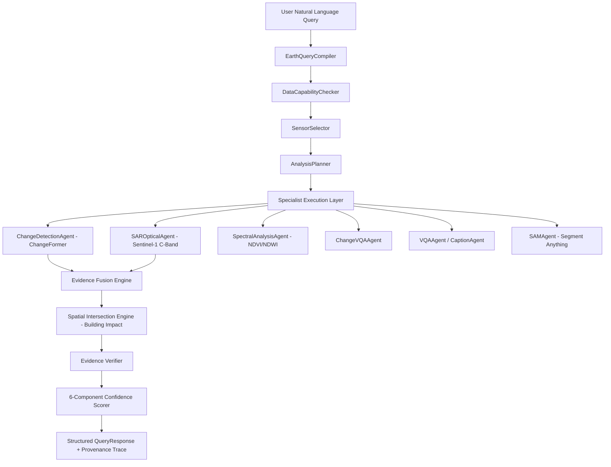

# SatQuery AI — Multi-Modal Task-Agnostic Architecture

SatQuery AI is an agentic geospatial analysis platform designed on a **Task-First, Capability-Aware** architectural paradigm.

---

## 1. Architectural Philosophy

Traditional remote sensing pipelines often hardcode sensor-to-task bindings (e.g. *Sentinel-1 implies flood detection*). SatQuery AI rejects sensor-first design:

```
BAD:  Sentinel-1 SAR → Flood Detection
GOOD: User Query → Task Intent → Required Evidence → Selected Sensor(s) → Specialist Models → Fusion → Verification → Audit Trace
```

### Core Tenets:
1. **Task-First Orchestration**: The analytical task drives sensor selection and specialist model dispatch.
2. **Authentic Sensor Groundedness**: Every numerical metric originates from actual rasterio/NumPy computation on valid pixels. No fake detections or fabricated NDVI numbers are returned when data is absent.
3. **Multi-Modal Evidence Fusion**: When complementary sensors are available (e.g. Optical RGB/multispectral and Sentinel-1 C-band SAR), evidence is mathematically fused using configurable strategies (weighted average, union, intersection).
4. **Independent Verification & Re-planning**: An evidence verifier cross-validates outputs, checks mathematical boundaries (e.g., affected buildings ≤ total buildings), flags sensor divergence, and triggers re-planning when needed.
5. **Auditable Provenance**: Every execution step logs millisecond-level runtimes, data capabilities, and intermediate artifacts into an execution trace.

---

## 2. Pipeline Execution Flow



---

## 3. Task Taxonomy

| Task Identifier | Primary Evidence Required | Primary Sensors | Specialists Invoked |
|---|---|---|---|
| `change_detection` | Optical bi-temporal difference | Sentinel-2 / Optical | `ChangeDetectionAgent` (ChangeFormer) |
| `change_vqa` | Temporal change + conversational assessment | Optical / Multi-modal | `ChangeDetectionAgent`, `ChangeVQAAgent` |
| `urban_change` | Building appearance + double-bounce backscatter | Optical + Sentinel-1 | `ChangeDetectionAgent`, `SAROpticalAgent` |
| `vegetation_change`| Calibrated NIR / Red spectral index (NDVI) | Sentinel-2 MSI | `SpectralAnalysisAgent` (SAR intentionally NOT primary) |
| `flood_impact` | Specular backscatter drop + optical water index | Sentinel-1 SAR + Optical | `SAROpticalAgent`, Building Segmentation, Spatial Intersection |
| `sar_change` | Log-ratio C-band backscatter change | Sentinel-1 GRD | `SAROpticalAgent` |
| `fire_analysis` | NBR burn severity index + SAR structure | Sentinel-2 + SAR | `SpectralAnalysisAgent`, `SAROpticalAgent` |
| `object_extraction`| Zero-shot / Building polygon boundaries | Optical | `SAROpticalAgent`, `SAMAgent` |
| `semantic_analysis`| Qualitative scene semantics & interpretation | Optical / Any | `VQAAgent`, `CaptionAgent` |
| `sar_optical_joint`| Multi-sensor cross-validation | Sentinel-1 + Sentinel-2 | `SAROpticalAgent`, `ChangeDetectionAgent` |

---

## 4. Multi-Sensor Evidence Fusion

The generic fusion service (`backend/services/evidence_fusion.py`) operates across arbitrary binary evidence masks without baking in domain-specific assumptions:

- **Weighted Average**: Combines normalized evidence probabilities according to sensor reliability. High optical cloud cover (>30%) automatically boosts SAR weight up to 0.85.
- **Spatial Agreement**: Calculates exact intersection-over-union between sensor masks:
  $$\text{Agreement} = \frac{|M_{\text{SAR}} \cap M_{\text{Optical}}|}{|M_{\text{SAR}} \cup M_{\text{Optical}}|}$$
- **Disagreement Notification**: If sensor agreement falls below 0.40, a conflict warning is logged and surfaced in the provenance trace and verifier report.

---

## 5. Verification & Confidence Breakdown

Confidence is computed as a weighted harmonic mean across six distinct evidence signals:
1. **Task Classification Certainty** (0.15)
2. **Sensor Compatibility** (0.20) — verifies true raster types (e.g. S1 GRD GeoTIFF vs standard RGB)
3. **Model Output Quality** (0.25) — valid pixel ratios and inference confidence
4. **Evidence Agreement** (0.15) — inter-agent and cross-sensor agreement
5. **Temporal Consistency** (0.10) — chronological pair ordering and baseline verification
6. **Answer Groundedness** (0.15) — confirmation that the answer derives from evaluated pixels rather than fallbacks
